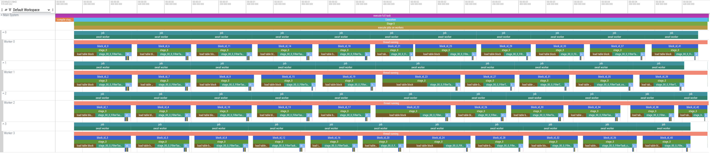

# 🔬 Inner workings

This section explains what happens inside **minispark** when you run a query — from text to final result.

## 1) Start with some data and a query
### Users
```bash
╭───────────┬──────────────┬─────────────┬───────┬───────────╮
│   user_id │ first_name   │ last_name   │   age │ country   │
├───────────┼──────────────┼─────────────┼───────┼───────────┤
│         1 │ Alice        │ Smith       │    25 │ USA       │
│         2 │ Bob          │ Johnson     │    30 │ Canada    │
│         3 │ Charlie      │ Brown       │    22 │ USA       │
│         4 │ David        │ Wilson      │    35 │ UK        │
│         5 │ Eva          │ Davis       │    28 │ Canada    │
│         6 │ Frank        │ Miller      │    40 │ USA       │
│         7 │ Grace        │ Taylor      │    27 │ UK        │
│         8 │ Hank         │ Anderson    │    32 │ USA       │
│         9 │ Ivy          │ Thomas      │    26 │ Canada    │
│        10 │ Jack         │ Jackson     │    24 │ USA       │
╰───────────┴──────────────┴─────────────┴───────┴───────────╯
```
### Orders
```bash
╭────────────┬───────────┬───────────┬────────────┬─────────┬─────────────────────╮
│   order_id │   user_id │ product   │   quantity │   price │ order_date          │
├────────────┼───────────┼───────────┼────────────┼─────────┼─────────────────────┤
│          1 │         1 │ Laptop    │          1 │    1200 │ 2025-01-01 00:00:00 │
│          2 │         2 │ Mouse     │          2 │      25 │ 2025-01-05 00:00:00 │
│          3 │         3 │ Keyboard  │          1 │      45 │ 2025-02-10 00:00:00 │
│          4 │         1 │ Monitor   │          2 │     300 │ 2025-03-15 00:00:00 │
│          5 │         4 │ Laptop    │          1 │    1100 │ 2025-03-20 00:00:00 │
│          6 │         5 │ Mouse     │          1 │      30 │ 2025-04-01 00:00:00 │
│          7 │         6 │ Keyboard  │          2 │      50 │ 2025-04-10 00:00:00 │
│          8 │         7 │ Monitor   │          1 │     280 │ 2025-05-05 00:00:00 │
│          9 │         8 │ Laptop    │          1 │    1300 │ 2025-05-10 00:00:00 │
│         10 │         9 │ Mouse     │          3 │      27 │ 2025-06-01 00:00:00 │
╰────────────┴───────────┴───────────┴────────────┴─────────┴─────────────────────╯
```

### Query:
```sql
SELECT u.country, COUNT() AS orders_count, SUM(o.quantity*o.price) AS total_sales
FROM 'users' AS u
    JOIN 'orders' AS o ON u.user_id=o.user_id
GROUP BY u.country
HAVING SUM(o.quantity*o.price) > 500;
```

## 2) Parsing (PEG — Parsimonious)

- The SQL text is passed to a **PEG parser** implemented with [Parsimonious](https://github.com/erikrose/parsimonious).  
- The result of this parsing step is a *DataFrame* object that represents the query in a structured way.

```python
df = (
    DataFrame()
    .table('users').alias('u')
    .join(
        DataFrame().table('orders').alias('o'),
        on=Col('u.user_id') == Col('o.user_id'),
        how="inner"
    )
    .group_by(Col('u.country'))
    .agg(
        F.count().alias('orders_count'),
        F.sum(Col('o.quantity') * Col('o.price')).alias('total_sales')
    )
    .filter(F.col("total_sales") > 500)
    .select(Col("u.country"), Col("orders_count"), Col("total_sales"))
)
```

Notice that the translation from SQL to the *DataFrame* is not straightforward:

- Selections are done in the end
- `HAVING` conditions are done after the aggregation
- `COUNT` and `SUM` appear in the select statement but need to be computed during aggregation

## 3) Logical Plan

This dataframe is now converted into a logical plan

```python
 Project(u.country, orders_count, total_sales):None
  +-  Filter((_having_sum_o.quantity_mul_o.price) > (500)):None
    +-  AggregateTask(group_by: u.country, agg: [
            AggCol(original_col=Lit(value=1), name='orders_count', type='sum'),
            AggCol(original_col=BinaryOperatorColumn(left_side=o.quantity, right_side=o.price, operator=<built-in function mul>, left_type_convert_to=None, right_type_convert_to=None), name='total_sales', type='sum'),
            AggCol(original_col=BinaryOperatorColumn(left_side=o.quantity, right_side=o.price, operator=<built-in function mul>, left_type_convert_to=None, right_type_convert_to=None), name='_having_sum_o.quantity_mul_o.price', type='sum')
        ]):None
      +-  JoinTask((u.user_id) == (o.user_id), "inner"):None
        +-  LoadTableBlockTask(users):None
        +-  LoadTableBlockTask(orders):None
```

This format is similar to what you would find in other query engines like Spark or DuckDB.
You read it from the bottom up, indentations indicate data flow, the `:none` at the end will be explained soon.

- 2 `LoadTableBlock` tasks read the `users` and `orders` tables
- The `JoinTask` combines them into a new intermediate table
- The `AggregateTask` groups by country and computes the aggregations
  - Notice that there are 3 aggregations
  - The last one is an internal one used to compute the `HAVING` condition
  - Each aggregation stores the computation needed to compute it
    - `orders_count` is a `sum` over the literal `1` -> this computes the count
    - `total_sales` is a `sum` over the expression (`BinaryOperatorColumn`) `o.quantity * o.price`
- The `Filter` task applies the `HAVING` condition
- The `Project` task selects the final columns to return


## 4) Physical Plan

The logical plan is converted into a Physical Plan.
A physical plan consists of multiple stages that will be executed one after the other (a barrier, where all workers need to wait until the stage is finished, to continue). Each stage will output one or more files that will be read by the next stage.
Each worker has a dedicated folder to write its (output/shuffle) files to, so that they can safely run in parallel.
This plan now also contains schema information from the source tables and their propagated schemas.

```python
# Stage 0
 WriteToShufflePartitions(u.user_id)
  schema = [u.user_id:INTEGER, u.first_name:STRING, u.last_name:STRING, u.age:INTEGER, u.country:STRING]
  +-  LoadTableBlockTask(users)
       schema = [u.user_id:INTEGER, u.first_name:STRING, u.last_name:STRING, u.age:INTEGER, u.country:STRING]
----------
# Stage 1
 WriteToShufflePartitions(o.user_id)
  schema = [o.order_id:INTEGER, o.user_id:INTEGER, o.product:STRING, o.quantity:INTEGER, o.price:FLOAT, o.order_date:TIMESTAMP]
  +-  LoadTableBlockTask(orders)
       schema = [o.order_id:INTEGER, o.user_id:INTEGER, o.product:STRING, o.quantity:INTEGER, o.price:FLOAT, o.order_date:TIMESTAMP]
----------
# Stage 2
 WriteToShufflePartitions(u.country)
  schema = [u.country:STRING, orders_count:INTEGER, total_sales:FLOAT, _having_sum_o.quantity_mul_o.price:FLOAT]
  +-  AggregateTask(group_by: u.country, agg: [...], before_shuffle:True)
       schema = [u.country:STRING, orders_count:INTEGER, total_sales:FLOAT, _having_sum_o.quantity_mul_o.price:FLOAT]
    +-  Join((u.user_id) == (o.user_id), "inner")
         schema = [u.user_id:INTEGER, u.first_name:STRING, u.last_name:STRING, u.age:INTEGER, u.country:STRING,
                   o.order_id:INTEGER, o.user_id:INTEGER, o.product:STRING, o.quantity:INTEGER, o.price:FLOAT, o.order_date:TIMESTAMP]
----------
# Stage 3
 WriteToLocalFileTask():[country:STRING, orders_count:INTEGER, total_sales:FLOAT]
  +-  Project((u.country) AS country, (orders_count) AS orders_count, (total_sales) AS total_sales)
       schema = [country:STRING, orders_count:INTEGER, total_sales:FLOAT]
    +-  Project(u.country, orders_count, total_sales)
         schema = [u.country:STRING, orders_count:INTEGER, total_sales:FLOAT]
      +-  Filter((_having_sum_o.quantity_mul_o.price) > (500))
           schema = [u.country:STRING, orders_count:INTEGER, total_sales:FLOAT, _having_sum_o.quantity_mul_o.price:FLOAT]
        +-  AggregateTask(group_by: u.country, agg: [...], before_shuffle:False)
             schema = [u.country:STRING, orders_count:INTEGER, total_sales:FLOAT, _having_sum_o.quantity_mul_o.price:FLOAT]
          +-  LoadShuffleFile()
               schema = [u.country:STRING, orders_count:INTEGER, total_sales:FLOAT, _having_sum_o.quantity_mul_o.price:FLOAT]
----------
```


- **Stage 0**: Load the `users` table and distribute rows into shuffle partitions `left.partition_i` based on `user_id` (the join key)
- **Stage 1**: Load the `orders` table and distribute rows into shuffle partitions `right.partition_i` based on `user_id` (the join key)
- **Stage 2**:
    - Choose a partition `i` based on the job (will be explained later)
    - Load the shuffled data from the left side (read full `left.partition_i`)
    - Load the shuffled data from the right side (read block by block from `right.partition_i`)
    - Perform the `JOIN` (using a hash join)
    - Do a local aggregation by `country` and write results to shuffle partitions `worker_j_agg_i` based on `country` (the group by key)
- **Stage 3**:
    - Choose a partition `i` based on the job (will be explained later)
    - Read shuffle files from all workers `worker_x_agg_i`
    - Aggregate the data by `country` (final aggregation)
    - Filter results based on the `HAVING` condition
    - Project the final columns (notice that we remove the table alias names)
    - Write the final results to a local file

Notice that we do the aggregation twice. First we *pre-aggregate* the data so that the shuffle files are smaller. Then we do the final aggregation after the shuffle.

## 5) Job Creation
A job in **minispark** corresponds to running a stage for one part of the input data. Depending on the execution engine, jobs can be run sequentially or in parallel.
In our example the following jobs would be run:

- **Stage 0**: Create a job for each partition of the `users` table, load the data and write to shuffle partitions based on `user_id` (block by block) **`ScanJob(file=..., block_id=...)`**
- **Stage 1**: Create a job for each partition of the `orders` table, load the data and write to shuffle partitions based on `user_id` (block by block) **`ScanJob(file=..., block_id=...)`**
- **Stage 2**: The *driver* collects the locations of shuffle partitions created in stages 0 and 1. Each partition `i` creates a job containing the shuffle files from the left side and the shuffle files from the right side (with the same partition number). **`JoinJob(left_shuffle_files=..., right_shuffle_files=..., parition=i)`**
- **Stage 3**: The *driver* collects the list of shuffle partitions created in stage 2 and bundles them per partition `i` **`LoadShuffleFilesJob(files=..., partition=i)`**.
- **Finally**: The *driver* collects the output files from stage 3 and streams them to the user (`collect` / `show`).

## 6) Execution

The execution engine takes care of running the jobs. Depending on the engine, jobs can be run sequentially (PythonEngine) or in parallel (ThreadPoolEngine).
The *driver* coordinates the job creation (per stage), execution of the stages and collection of results.
Each stage is a *chunk* pipeline, starting with a *Producer*, leading to *Consumers* and ending with a *Writer*.

- Producer: `JoinTask`, `LoadTableBlockTask`, `LoadShuffleFile`
- Consumers: `AggregateTask`, `Filter`, `Project`
- Writer: `WriteToShufflePartitions`, `WriteToLocalFileTask`

We try to chunk the data so that we don't run out of memory. The `AggregateTask` / `JoinTask` however, need to keep an in-memory hash map of the full partition it processes (left-partition for the JoinTask).

### Example of the Execution of Stage 2

#### Join produces the following table
```bash
╭─────────────┬────────────────┬───────────────┬─────────┬─────────────┬──────────────┬─────────────┬─────────────┬──────────────┬───────────┬─────────────────────╮
│   u.user_id │ u.first_name   │ u.last_name   │   u.age │ u.country   │   o.order_id │   o.user_id │ o.product   │   o.quantity │   o.price │ o.order_date        │
├─────────────┼────────────────┼───────────────┼─────────┼─────────────┼──────────────┼─────────────┼─────────────┼──────────────┼───────────┼─────────────────────┤
│           1 │ Alice          │ Smith         │      25 │ USA         │            1 │           1 │ Laptop      │            1 │      1200 │ 2025-01-01 00:00:00 │
│           2 │ Bob            │ Johnson       │      30 │ Canada      │            2 │           2 │ Mouse       │            2 │        25 │ 2025-01-05 00:00:00 │
│           3 │ Charlie        │ Brown         │      22 │ USA         │            3 │           3 │ Keyboard    │            1 │        45 │ 2025-02-10 00:00:00 │
│           1 │ Alice          │ Smith         │      25 │ USA         │            4 │           1 │ Monitor     │            2 │       300 │ 2025-03-15 00:00:00 │
│           4 │ David          │ Wilson        │      35 │ UK          │            5 │           4 │ Laptop      │            1 │      1100 │ 2025-03-20 00:00:00 │
│           5 │ Eva            │ Davis         │      28 │ Canada      │            6 │           5 │ Mouse       │            1 │        30 │ 2025-04-01 00:00:00 │
│           6 │ Frank          │ Miller        │      40 │ USA         │            7 │           6 │ Keyboard    │            2 │        50 │ 2025-04-10 00:00:00 │
│           7 │ Grace          │ Taylor        │      27 │ UK          │            8 │           7 │ Monitor     │            1 │       280 │ 2025-05-05 00:00:00 │
│           8 │ Hank           │ Anderson      │      32 │ USA         │            9 │           8 │ Laptop      │            1 │      1300 │ 2025-05-10 00:00:00 │
│           9 │ Ivy            │ Thomas        │      26 │ Canada      │           10 │           9 │ Mouse       │            3 │        27 │ 2025-06-01 00:00:00 │
│          10 │ Jack           │ Jackson       │      24 │ USA         │           11 │          10 │ Keyboard    │            1 │        40 │ 2025-06-15 00:00:00 │
│          11 │ Kate           │ White         │      29 │ UK          │           12 │          11 │ Monitor     │            2 │       290 │ 2025-07-01 00:00:00 │
│          12 │ Leo            │ Harris        │      33 │ USA         │           13 │          12 │ Laptop      │            1 │      1250 │ 2025-07-10 00:00:00 │
│          13 │ Mia            │ Martin        │      31 │ Canada      │           14 │          13 │ Mouse       │            2 │        26 │ 2025-07-15 00:00:00 │
│          14 │ Nick           │ Thompson      │      23 │ UK          │           15 │          14 │ Keyboard    │            1 │        42 │ 2025-08-01 00:00:00 │
╰─────────────┴────────────────┴───────────────┴─────────┴─────────────┴──────────────┴─────────────┴─────────────┴──────────────┴───────────┴─────────────────────╯
```
#### The Aggregate task groups by country and computes the aggregations
```bash
╭─────────────┬────────────────┬───────────────┬──────────────────────────────────────╮
│ u.country   │   orders_count │   total_sales │   _having_sum_o.quantity_mul_o.price │
├─────────────┼────────────────┼───────────────┼──────────────────────────────────────┤
│ Canada      │              4 │           213 │                                  213 │
│ UK          │              4 │          2002 │                                 2002 │
│ USA         │              7 │          4535 │                                 4535 │
╰─────────────┴────────────────┴───────────────┴──────────────────────────────────────╯
```
#### The filter task filters out countries with total sales <= 500
```bash
╭─────────────┬────────────────┬───────────────┬──────────────────────────────────────╮
│ u.country   │   orders_count │   total_sales │   _having_sum_o.quantity_mul_o.price │
├─────────────┼────────────────┼───────────────┼──────────────────────────────────────┤
│ UK          │              4 │          2002 │                                 2002 │
│ USA         │              7 │          4535 │                                 4535 │
╰─────────────┴────────────────┴───────────────┴──────────────────────────────────────╯
```
#### The project task renames the columns leading to the final output
```bash
╭─────────────┬────────────────┬───────────────╮
│ u.country   │   orders_count │   total_sales │
├─────────────┼────────────────┼───────────────┤
│ UK          │              4 │          2002 │
│ USA         │              7 │          4535 │
╰─────────────┴────────────────┴───────────────╯
```


### Code Generation

To speed up execution, the `ThreadPoolEngine` compiles the full plan to Zig code (via templating).
This code is then compiled once and executed on a thread pool natively, leading to significant speedups.
The communication between the Python threads and the native threads is done via files (shuffle files, output files) and `stdin`/`stdout` for jobs.

Here is a trace of the TPC-H benchmark (query 1, with 4 worker threads).


